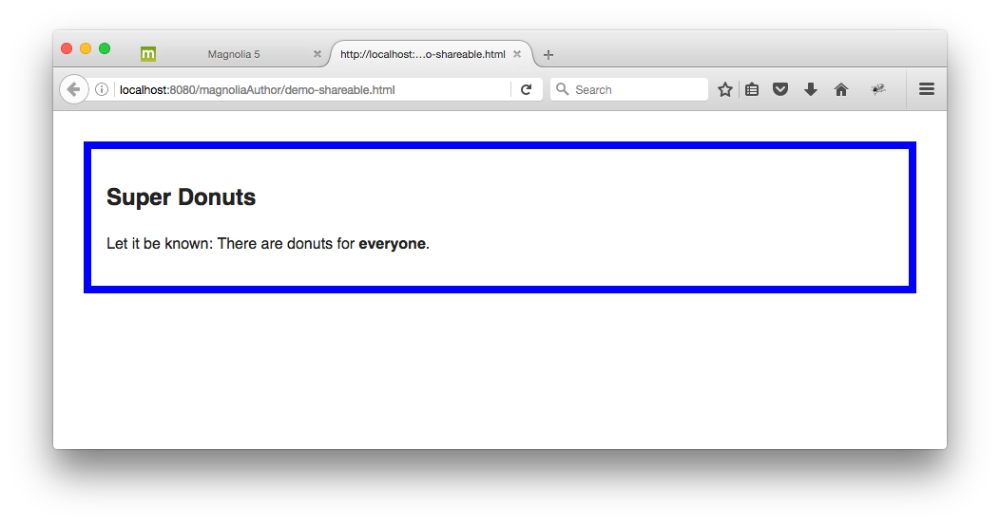
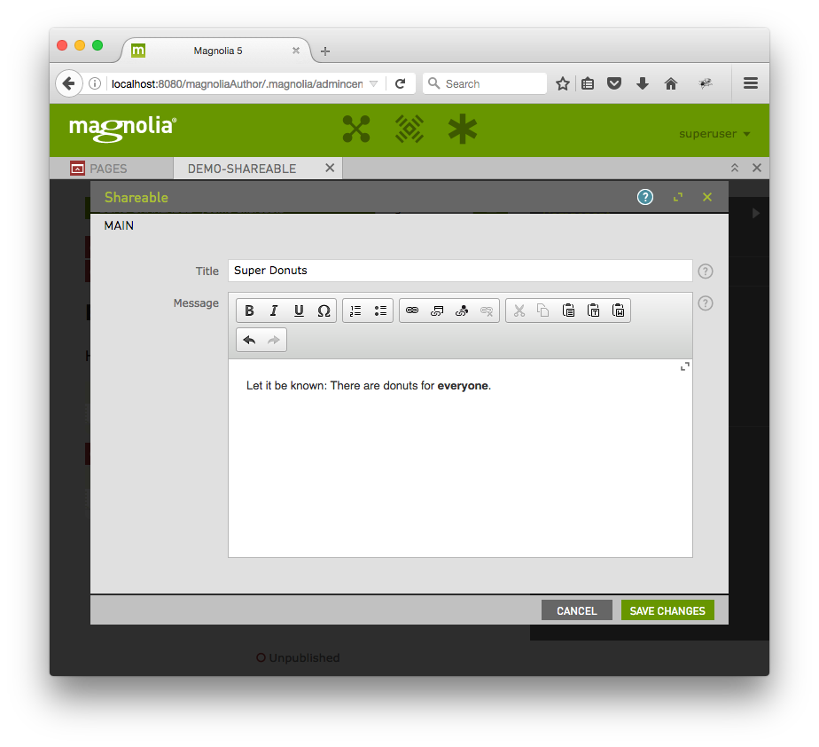

# Shareable (Demonstrates how to share light modules)- Component template for Magnolia CMS

[Provide a basic description in one sentence.]

## Features ##
[Provide a list of the key features.]

## Usage ##
[Provide any specific usage instructions.]

## Demo ##
[Provide how to view the demo.]
To see a page demonstrating this component, open the Pages app in Magnolia AdminCentral and import the file in 'dev/importsSamples'. (Import it directly at the root of the tree to see a demo of the included css styling.)

## Information on Magnolia CMS
https://docs.magnolia-cms.com

This directory is a Magnolia 'light module'.
https://documentation.magnolia-cms.com/display/DOCS/Light+development+in+Magnolia

## Contribute to the Magnolia component ecosystem
It's easy to create components for Magnolia and share them on github and npm. I invite you to do so and join the community. Let's stop wasting time by developing the same thing again and again, rather let's help each other out by sharing our work and create a rich library of components.

Just add magnolia-light-module and magnolia-component as keywords to npm's package.json to make them easy to find and use on npm.

## License

MIT

## Contributors

Christopher Zimmermann, @topherzee
